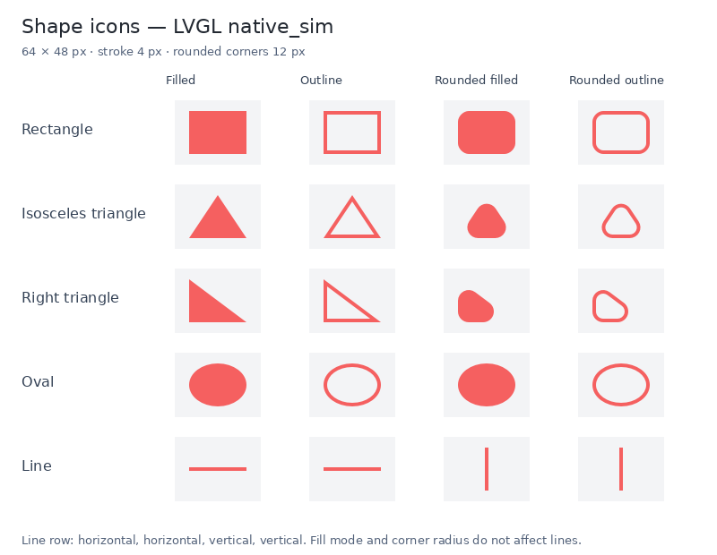

# Shape icons

`IconFactory` creates `Rectangle`, `TriangleIsosceles`, `TriangleRight`, `Oval`,
and `Line`. Use these `IconType` values with `BasicIcon` or `BasicArcIcon` widgets.
The isosceles triangle points up; the right triangle has its right angle at the
bottom left. An oval with equal width and height is a circle.



## Properties

| Property | Type | Default | Meaning |
| --- | --- | --- | --- |
| `WIDTH_PX` | Integer | 32 | Width of the icon's bounding box in pixels |
| `HEIGHT_PX` | Integer | 32 | Height of the icon's bounding box in pixels |
| `STROKE_PX` | Integer | 2 | Outline or line thickness |
| `CORNER_RAD_PX` | Integer | 0 | Corner radius for rectangles and both triangles |
| `FILL_MODE` | `WidgetFillMode` as integer | `Filled` (0) | `Filled` (0) or `Outline` (1) |
| `DIRECTION` | `WidgetDirection` as integer | `LeftToRight` (1) | Line orientation and endpoint order |

These dimensions are independent of the owning widget's grid size and the
`IMG_WIDTH` / `IMG_HEIGHT` properties used by image icons. Shape properties are
registered by `IconWidget` and support the existing event bindings. Changes
while a widget is inactive are applied when it is activated again.

Filled shapes ignore thickness. Outline interiors are transparent, so content
behind the icon remains visible. Corner radius is clamped to fit: half the
smaller dimension for rectangles, and the triangle's inradius for triangles.
Thick outlines become filled when there is no room for an interior hole.
Corner radius does not affect ovals or lines. Lines always draw a stroke,
regardless of fill mode.

`WidgetDirection` replaces the former `InidicatorDirection` type and
`widget_direction.h` replaces `indicator_direction.h`. Its persisted values
are unchanged:

| Value | Direction | Line geometry |
| --- | --- | --- |
| 0 | `None` | Uses the default, left to right |
| 1 | `LeftToRight` | Horizontal, spanning `WIDTH_PX` |
| 2 | `RightToLeft` | Same horizontal segment, reversed endpoints |
| 3 | `TopToBottom` | Vertical, spanning `HEIGHT_PX` |
| 4 | `BottomToTop` | Same vertical segment, reversed endpoints |

A horizontal line is centered vertically in its box; a vertical line is centered
horizontally. The unused dimension may be zero. The actual box expands to at
least the stroke thickness across the line, keeping the entire stroke visible.
Opposite directions have identical appearance for a plain line. Diagonal line
directions are not defined by this enum.

Shapes use the theme's accent color and opacity. `IS_ACTIVE=false` makes the
icon transparent, and `IS_VISIBLE` continues to control the owning widget.

## Example

```cpp
#include "domain/ui_domain/models/icon_type.h"
#include "domain/ui_domain/models/widget_fill_mode.h"

// Using the existing WidgetConfiguration allocated for this widget:
widget->type = WidgetType::BasicIcon;
widget->properties["ICON_TYPE"] = static_cast<int>(IconType::TriangleRight);
widget->properties["WIDTH_PX"] = 80;
widget->properties["HEIGHT_PX"] = 48;
widget->properties["STROKE_PX"] = 3;
widget->properties["CORNER_RAD_PX"] = 8;
widget->properties["FILL_MODE"] = static_cast<int>(WidgetFillMode::Outline);
```

For a vertical line, set `ICON_TYPE` to `IconType::Line`, `DIRECTION` to
`static_cast<int>(WidgetDirection::TopToBottom)`, `WIDTH_PX` to 0, and
`HEIGHT_PX` to the desired length. Include `widget_direction.h` when using the
direction enum.

## Rendering and limits

LVGL's vector API and its bundled ThorVG renderer generate an antialiased alpha
mask. Geometry is rasterized in 32-by-32 pixel tiles with a two-pixel halo. The
temporary ARGB buffer is approximately 5–7 KiB, depending on board alignment,
plus about 18 KiB of temporary renderer workspace on the LVGL heap. Only the
alpha mask persists: one byte per pixel plus row padding, allocated through the
existing external-memory resource.
Theme and active-state changes recolor the mask without rasterizing it again.

Dimensions must be in 0–32767, with both dimensions positive for closed shapes
and the length positive for lines. Invalid dimensions, zero outline/line
thickness, and masks exceeding 4 MiB suppress drawing. Negative radius and
thickness clamp to zero; positive values clamp to 32767 before fitting the
geometry. Numeric fractional pixel values are truncated to integers. Persisted
fill modes other than 0 or 1 are rejected; invalid bound fill modes fall back to
`Filled`, and invalid bound directions fall back to `LeftToRight`.

The application and the view/controller test configurations enable vector,
canvas, and ThorVG support. `cmake/lvgl_vector.cmake` adds ThorVG's C++ sources
to Zephyr's LVGL target and supplies the missing POSIX header for its bundled
SVG loader. It also applies `lvgl_thorvg_raster_workspace.patch`, which moves
ThorVG's raster workspace off the caller's stack. With `LV_USE_OS` disabled,
canvas rendering runs on the UI/event worker; `LV_DRAW_THREAD_STACK_SIZE`
does not enlarge that worker's stack. The unpatched rasterizer needs about
18 KiB for one function and corrupts the app's smaller worker stacks, sometimes
crashing another thread later when an overlay opens.

Existing property, icon, and direction identifiers retain their
numeric values; the CBOR schema is unchanged.

## Verification

```sh
west twister -c --disable-warnings-as-errors -j 4 -p native_sim \
  -O ./twister-out-shapes -T ./tests/unit/domain \
  -T ./tests/functional/views -T ./tests/functional/controllers
west twister -c --disable-warnings-as-errors -j 4 -p qemu_cortex_a9 \
  -O ./twister-out-shapes-qemu -T ./tests/functional/views
west build -b native_sim -d build-shapes-native ./app
west build -b esp32p4_wifi6_touch_lcd_5/esp32p4/hpcore -d build-shapes-p4 ./app
```

The view tests cover rasterized geometry, transparent outlines, tile boundaries,
live bindings on the event worker, inactive replay, theme changes, arc placement,
object ownership, overlay redraws, and existing bar directions. Stack sentinels
and stack canaries are enabled in the view tests; the controller tests also
exercise opening and reopening an overlay above the shape screen.
To export individual rendered previews from the
native view-test executable, create a directory and set `SHAPE_ICON_PREVIEW_DIR`
to it when running the `shape_icons` suite. The previews are PPM files.

The simulator and P4 firmware builds have been checked. Physical display
rendering and hardware performance have not been tested.
