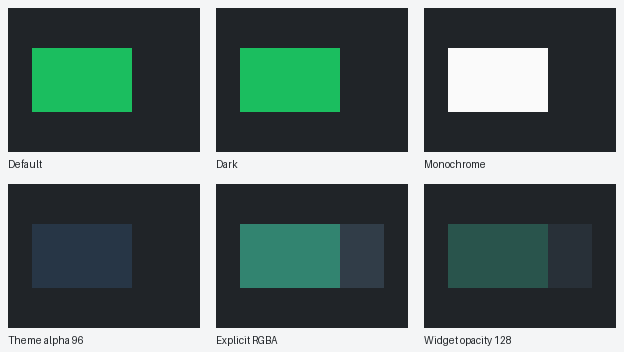
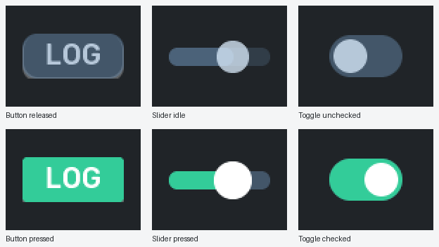
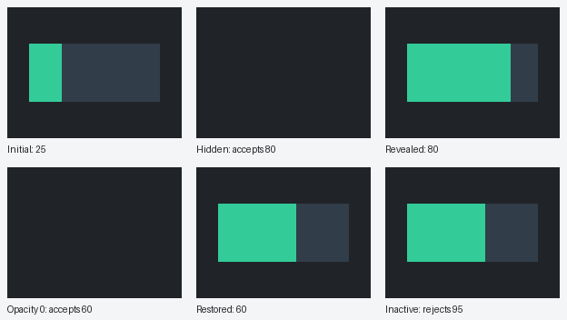

# Widget appearance

Colors, whole-widget opacity, visibility, and event-processing activity are
independent. Existing configurations without appearance overrides keep their
normal appearance. Widgets animate only when explicitly configured. Use `OvalIcon`
with equal `WIDTH_PX` and `HEIGHT_PX` values for a circular indicator; blinking is
configured through the shared widget animation properties.

## Configure RGBA and opacity

Use `std::pmr::string` colors in the exact format `#RRGGBBAA`. The final byte is
required alpha: `00` is transparent, `80` is approximately half coverage, and
`FF` is opaque. Uppercase and lowercase digits are accepted. Six-digit RGB,
malformed text, and non-string colors are rejected. Invalid runtime writes leave
the previous value intact; invalid persisted properties fail validation.

For an existing bar widget configuration:

```cpp
#include "domain/ui_domain/models/widget_property.h"
#include "utilities/memory/memory_resource_manager.h"

using eerie_leap::domain::ui_domain::models::WidgetPropertyType;
using eerie_leap::utilities::memory::Mrm;

widget->properties[WidgetPropertyType::COLOR_PRIMARY_ACTIVE] =
    std::pmr::string("#33CC9980", Mrm::GetExtPmr());
widget->properties[WidgetPropertyType::COLOR_SECONDARY_ACTIVE] =
    std::pmr::string("#6688AA40", Mrm::GetExtPmr());
widget->properties[WidgetPropertyType::OPACITY] = 128;
```

The primary property colors the fill; secondary colors the background track.
Alpha 128 with widget opacity 128 gives approximately 25% coverage before
ancestor opacity and mask coverage. Colors replace theme RGBA, including alpha;
they do not multiply by theme alpha. Whole-widget opacity uses LVGL layered
composition, so overlapping parts fade together. Images and dial needles keep
their original colors and pixel alpha and inherit exactly one widget fade.

`OPACITY` defaults to 255 and accepts integers 0-255. Runtime bindings also
accept in-range unsigned integers, but not floats, booleans, or strings.
Transparent color alpha alone does **not** suspend tracking or rendering.

## Reset and theme fallback

An omitted color or an empty string selects the current theme/default. Explicit
transparent black (`#00000000`) is a color override, not a reset.

```cpp
widget->properties[WidgetPropertyType::COLOR_PRIMARY_ACTIVE] =
    std::pmr::string("", Mrm::GetExtPmr());
widget->properties.erase(WidgetPropertyType::COLOR_SECONDARY_ACTIVE);
widget->properties.erase(WidgetPropertyType::OPACITY);
```

Apply the updated configuration through the normal configuration path, or call
the live widget's `Configure(widget)` under the LVGL lock. Merely editing the
configuration map is not a live update. Omitting a previously supplied property
from a reapplied configuration restores its registered default.

Fallback is resolved from the current theme and never persisted. Each role and
state resolves independently: an unset inactive color does not inherit its
active override, and secondary/tertiary roles do not inherit primary. Custom
theme alpha is honored, for example:

```cpp
class TranslucentTheme : public DefaultTheme {
public:
    LvglColor GetSecondaryColor() const override {
        return LvglColor(0x345678, 96);
    }
};
```

Here `DefaultTheme` is from `views/themes/default_theme.h`, and `LvglColor` is
from `views/utilities/lvgl_color.h`. The theme and wrapper namespaces are
`eerie_leap::views::themes` and `eerie_leap::views::utilities`, respectively.

## Supported roles

`ACTIVE`/`INACTIVE` suffixes select visual states, never processing activity.
"Pair" below means both suffixes. Use `GetSupportedProperties()` to discover
the selected widget/icon's usable keys.

| Widget | Primary | Secondary | Tertiary | Selection/default |
| --- | --- | --- | --- | --- |
| Digital / setting | Active text | - | - | Theme primary |
| Horizontal chart | Active series | - | - | Theme primary, line and bar |
| Bar / filled arc | Active fill | Active track | - | Theme secondary fill; transparent track |
| Segmented arc | Stroke pair | - | - | Displayed on/off; secondary/transparent |
| Shapes (including oval) | Active fill or stroke | - | - | Theme accent |
| Label icon | Active background | Active text | - | Accent/primary |
| Slider | Filled-track pair | Background pair | Knob pair | Pressed/idle; primary/surface/accent |
| Toggle | Track pair | Knob pair | - | Checked/unchecked; primary/surface track, accent knob |
| Button | Background pair | Text pair | - | Pressed/released; accent/surface background, primary text |
| Image / dial | None | None | None | Original image pixels |

Basic and arc icon wrappers expose only their selected icon's properties. For
a button's explicit released and pressed backgrounds:

```cpp
widget->properties[WidgetPropertyType::COLOR_PRIMARY_INACTIVE] =
    std::pmr::string("#6688AA80", Mrm::GetExtPmr());
widget->properties[WidgetPropertyType::COLOR_PRIMARY_ACTIVE] =
    std::pmr::string("#33CC99FF", Mrm::GetExtPmr());
```

The button synchronizes its child label's pressed state. The toggle's inactive
track remains underneath its checked indicator during transitions.

## Whole-widget animation

Every public widget supports the following properties, including basic/arc icon
wrappers, indicators, and controls. They affect the complete rendered widget,
not its layout rectangle or stored data.

| Property | Default | Accepted configuration value |
| --- | --- | --- |
| `ANIMATION_TYPE` | `0` (`None`) | Integer: `0` None, `1` Blinking, `2` Rotation |
| `IS_ANIMATION_ACTIVE` | `false` | Boolean requested enablement |
| `ANIMATION_DURATION_MS` | `1000` | Integer milliseconds per complete cycle, 2 through 2147483647 |

`Blinking` is a smooth eased fade: fully visible, transparent, then fully
visible within one duration. Odd durations give the extra millisecond to the
return half. `Rotation` turns clockwise once per duration at constant speed,
around the widget's anchor (`ANCHOR_POINT_X/Y`, centered by default. Both repeat indefinitely. Display refresh limits
visible timing; a 2 ms duration does not promise a 2 ms display update.

For an existing Dot or asymmetric icon configuration:

```cpp
#include "domain/ui_domain/models/animation.h"

using eerie_leap::domain::ui_domain::models::Animation;

widget->properties[WidgetPropertyType::ANIMATION_TYPE] =
    static_cast<int>(Animation::Type::Blinking);
widget->properties[WidgetPropertyType::IS_ANIMATION_ACTIVE] = true;
widget->properties[WidgetPropertyType::ANIMATION_DURATION_MS] = 1200;
```

For an existing dial configuration, configure the dial, not its needle:

```cpp
dial->properties[WidgetPropertyType::ANIMATION_TYPE] =
    static_cast<int>(Animation::Type::Rotation);
dial->properties[WidgetPropertyType::IS_ANIMATION_ACTIVE] = true;
dial->properties[WidgetPropertyType::ANIMATION_DURATION_MS] = 4000;
dial->properties[WidgetPropertyType::IS_SMOOTHED] = true;
```

The dial and its needle rotate together once; the needle's value rotation and
`IS_SMOOTHED` interpolation remain independent. The needle is a separately
configured child widget. It
may blink, but configuration checks reject a needle rotation animation because
the dial already drives its rotation. An image widget that is not a needle can
animate itself.
Apply configuration through the normal configuration path as described above.

Requested enablement is writable, **not** a running-state indicator. Type None
or active false leaves neutral presentation. Hidden, inactive, unready, or
zero-user-opacity widgets stop their generic effect but retain requested
settings. Restoring eligibility applies pending properties, including `VALUE`,
then restarts from full opacity/original orientation without hidden-time catch-up.
Changing type or duration also restarts; identical settings, data/color updates,
theme changes, and resizing preserve the current phase. Disabling animation
restores the presentation modifier, not the user's opacity or leaf transforms.

Animation fade multiplies `OPACITY` and existing RGBA alpha as a composed layer.
Its transparent midpoint does **not** hide or deactivate the widget: tracking,
dependent processing, focus, and input remain enabled. Use `IS_VISIBLE=false`
to hide and suspend input. Rotating controls use transformed hit testing;
external parent clipping still applies.

Animation properties use ordinary bindings and tracking rules: hidden widgets
retain the latest valid settings; explicit inactivity rejects incoming ordinary
settings. Type/duration bindings accept signed or in-range unsigned integers,
not floats, booleans, strings, or overflow. Active bindings accept booleans or
numeric exactly 0/1. Invalid input leaves the accepted setting unchanged.
Binding a logging signal to requested enablement requires an explicit binding;
existing logging visibility/default screens are not automatically migrated.

Only one generic effect runs per widget owner, alongside independent value
smoothing. Screen animations/transitions, stacking, custom easing, direction,
and phase synchronization are not supported. Whole-layer rotation and
fade require temporary composition buffers; hardware capacity and frame rate
must be measured for the intended widget sizes and simultaneous effects.

## Live bindings

Color bindings publish RGBA text, including an empty string for reset. For
example, using the UI model and sensor event-bus types:

```cpp
#include "utilities/string/string_helpers.h"

using eerie_leap::utilities::string::StringHelpers;

widget->bindings.push_back(PropertyBinding {
    .target = WidgetPropertyType::COLOR_PRIMARY_ACTIVE,
    .channel = EventChannelId::Sensors,
    .event_type = std::to_underlying(SensorEventType::DataUpdated),
    .payload_key = std::to_underlying(SensorPayloadType::Value),
    .selector_key = std::to_underlying(SensorPayloadType::SensorId),
    .selector_value = std::pmr::string("color_demo", Mrm::GetExtPmr())
});

SensorEventsChannel::GetInstance().Publish({
    .source_id = 0,
    .type = SensorEventType::DataUpdated,
    .payload = {
        { SensorPayloadType::SensorId, StringHelpers::GetHash("color_demo") },
        { SensorPayloadType::Value, std::string("#33CC9980") }
    }
});
```

Include `domain/ui_domain/models/property_binding.h`, `event_bus/event_channel_id.h`,
and `domain/sensor_domain/event_bus/sensor_events_channel.h`. `PropertyBinding`
belongs to `eerie_leap::domain::ui_domain::models`, `EventChannelId` to
`eerie_leap::event_bus`, and the sensor types to
`eerie_leap::domain::sensor_domain::event_bus`. Initialize the application's
event channels before publishing. Register bindings before configuring/rendering;
only supported targets subscribe. Configured sensor-name selectors are hashed
by the binding dispatcher; publish the matching hash in `SensorId` as above.
Publish from services rather than accessing
LVGL directly; widget dispatch takes the LVGL lock before its dispatch guard.

## Activity and compatibility

All three management properties default to enabled/full coverage:
`IS_ACTIVE=true`, `IS_VISIBLE=true`, `OPACITY=255`.

| Condition on widget/owner | Incoming ordinary properties | Visual work and local input |
| --- | --- | --- |
| Explicit `IS_ACTIVE=false` | Rejected before storage | Suspended, current appearance retained |
| Hidden widget, ancestor, screen, or group | Latest valid value retained per property | Suspended |
| Widget/owner `OPACITY=0` | Latest valid value retained per property | Suspended |
| Active, effectively visible, positive opacity | Accepted and applied | Enabled once rendered |

`IS_ACTIVE`, `IS_VISIBLE`, and `OPACITY` bindings remain eligible under every
condition so suspended widgets can be restored. Activity/visibility bindings
accept booleans or numeric 0/1; direct configuration/store values require booleans.
Restoration waits for **all** rendering gates to open, then applies retained
properties without another source event. Hidden updates coalesce; charts do not
reconstruct every hidden sample. Updates rejected during explicit inactivity
are never replayed. Inactive controls cannot publish, navigate, or change values.

Persisted IDs 0-33 and CBOR version 1/layout are unchanged. Opacity is ID 34;
the six colors are IDs 35-40; animation type, requested active, and duration are
IDs 41-43. Old configurations load without enabling animations. Older firmware
rejects these new IDs; this is not downgrade compatibility. Color
membership/cache indexing uses an explicit list, not consecutive enum IDs.

Migrate old icon configurations that used `IS_ACTIVE=false` to hide:

```cpp
widget->properties.erase(WidgetPropertyType::IS_ACTIVE);
widget->properties[WidgetPropertyType::IS_VISIBLE] = false;
```

Retarget their show/hide bindings to `IS_VISIBLE` too. The built-in logging dot
already follows this rule and stays static. If inactivity formerly selected a
label's alternate palette, use explicit normal-appearance color overrides
instead. Do not reinterpret every persisted false activity flag as invisibility:
it now means paused tracking and processing, not a palette or visibility state.

## Native simulator gallery

These are real LVGL snapshots from `widget_colors.test_simulator_gallery` in
[widget_colors.cpp](../../../tests/functional/views/src/widget_colors.cpp),
enlarged 2x with nearest-neighbor sampling. The deterministic buffer-only native
simulator gallery does not replace the application's sample screens or persist
demo configuration. Captions are added outside LVGL. The solid empty frames are
intentional hidden/zero-opacity cases, not missing assets.



Read left to right: default, dark, monochrome; translucent theme secondary
`#34567860`, explicit fill `#33CC9980` plus track `#6688AA40`, then the same
explicit colors with whole-widget opacity 128. Each bar's value is 70.



Columns are button, slider, and toggle. Top: released/idle/unchecked.
Bottom: pressed/pressed/checked. Activity remains true throughout.



Read left to right: value 25; hidden while values 50 and 80 arrive; revealed at
80. Then opacity zero while 60 arrives; restored at 60; activity disabled while
95 arrives and re-enabled, still showing 60. Assertions verify both the stale
display while suspended and the final value. Pixel checks require visible cases
to render content and hidden/transparent cases to render only the background.

### Regenerate

From the repository root in the development container:

```sh
mkdir -p twister-out-step7-previews
WIDGET_COLOR_PREVIEW_DIR="$PWD/twister-out-step7-previews" \
  west twister -c --disable-warnings-as-errors -j 4 -p native_sim \
  -O ./twister-out-step7-gallery -T ./tests/functional/views \
  -- -flash_in_ram '-test=widget_colors::test_simulator_gallery'
```

The test writes 18 numbered PPM files only when the environment variable is set.
Without it, the assertions still run on every supported test platform. Use a
normal Twister run as above: `--test-only` can skip an already-passing scenario.
The harness handles the native runner's post-report shutdown.

Assemble the documentation images with the container's Pillow installation:

```sh
python - <<'PY'
from pathlib import Path
from PIL import Image, ImageDraw

source = Path("twister-out-step7-previews")
frames = sorted(source.glob("*.ppm"))
assert len(frames) == 18
groups = {
    "rgba": ([0, 1, 2, 3, 4, 5], ["Default", "Dark", "Monochrome", "Theme alpha 96", "Explicit RGBA", "Widget opacity 128"]),
    "states": ([6, 8, 10, 7, 9, 11], ["Button released", "Slider idle", "Toggle unchecked", "Button pressed", "Slider pressed", "Toggle checked"]),
    "tracking": ([12, 13, 14, 15, 16, 17], ["Initial: 25", "Hidden: accepts 80", "Revealed: 80", "Opacity 0: accepts 60", "Restored: 60", "Inactive: rejects 95"]),
}
for name, (indices, captions) in groups.items():
    sheet = Image.new("RGB", (624, 352), "#f4f5f6")
    draw = ImageDraw.Draw(sheet)
    for position, (index, caption) in enumerate(zip(indices, captions)):
        left, top = (position % 3) * 208 + 8, (position // 3) * 176 + 8
        with Image.open(frames[index]) as image:
            assert image.size == (96, 72)
            sheet.paste(image.resize((192, 144), Image.Resampling.NEAREST), (left, top))
        draw.text((left, top + 150), caption, fill="#202428")
    sheet.save(f"app/docs/ui/images/widget_colors_{name}.png")
PY
```

The interactive application remains available with `west build -p auto -b native_sim ./app`
and `west build -t run` on an SDL-capable display. Its sample configuration is
independent of the deterministic gallery above.
